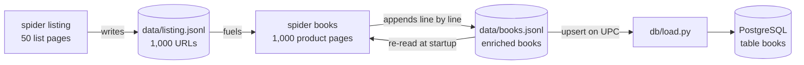

# Bouquineo — Competitor Price & Stock Scraper


Scrapes the public catalogue of a competitor bookstore
([books.toscrape.com](https://books.toscrape.com), a legal training sandbox —
1,000 books, 50 categories, static HTML) into PostgreSQL, to answer:

> Which titles are out of stock or low on stock, and which are the best rated?

## Results at a glance

| Question | Answer (full catalogue, n = 1,000) |
|---|---|
| Out of stock | **0 titles** (stock ranges 1–22 — an answer in itself) |
| Low stock (≤ 5 copies) | **420 titles**, of which **98 single-copy** |
| Best rated | **196 five-star titles**; top category (≥ 10 books): Poetry (3.53 avg) |

```sql
-- the restock signal, straight from the loaded table
SELECT title, category, stock FROM books ORDER BY stock ASC LIMIT 10;
```

Full data profiling (dead fields, sandbox artifacts, the duplicate-title
case) in [`notes_obs.md`](notes_obs.md) (French).

## Pipeline



The loop on `books.jsonl` is the resume mechanism: **the output file IS the
state**. Whatever reached disk when a crawl dies is exactly what was
collected; the next run skips it.

## Installation

```bash
uv sync                  # Python env + dependencies (uv reads .python-version)
cp env.example .env      # local defaults work as-is
docker compose up -d     # PostgreSQL 17 (only needed for the load step)
```

## Usage

```bash
uv run scrapy crawl listing            # D1: 50 list pages  -> data/listing.jsonl
uv run scrapy crawl books              # D2: product pages  -> data/books.jsonl
uv run scrapy crawl books -a limit=20  # sample mode: only 20 NEW pages this run
uv run python db/load.py               # load JSONL -> PostgreSQL (idempotent)
uv run pytest && uv run scrapy check   # unit tests + live spider contracts
```

One collected record looks like this:

```json
{"upc": "a897fe39b1053632", "title": "A Light in the Attic", "category": "Poetry",
 "price_excl_tax": 51.77, "price_incl_tax": 51.77, "tax": 0.0, "stock": 22,
 "rating": 3, "num_reviews": 0, "description": "It's hard to imagine…",
 "url": "https://books.toscrape.com/catalogue/a-light-in-the-attic_1000/index.html"}
```

## Prove the robustness in 2 minutes

The repo ships the full dataset, so a fresh clone resumes at 1,000/1,000 and
crawls nothing. Set it aside first to watch the machinery actually work:

```bash
mv data/books.jsonl data/books.jsonl.bak

uv run scrapy crawl books -a limit=5   # collects books 1-5
uv run scrapy crawl books -a limit=5   # logs "Resume: 5 books already collected",
                                       # collects books 6-10 — resume, demonstrated

uv run scrapy crawl books              # let it run ~30 s, then press Ctrl-C once
uv run scrapy crawl books              # "Resume: N books already collected" —
                                       # it picks up exactly where it stopped

uv run python db/load.py               # -> "table now holds N rows"
uv run python db/load.py               # same count, zero duplicates — idempotence

mv data/books.jsonl.bak data/books.jsonl   # restore the shipped dataset
```

## Design decisions

- **The output file IS the resume state.** Items are flushed to JSONL line by
  line as they are scraped; on startup the `books` spider re-reads its own
  output and skips known URLs. No checkpoint file, no DB dependency during
  crawling.
- **Decoupled loading (landing-zone pattern).** Spiders never touch the DB;
  `db/load.py` never touches the network. Fields are collected raw (even the
  ones the data proves dead — see `notes_obs.md`); conclusions about their
  usability belong to the observation note, not to the collector.
- **Two keys, two moments.** During the crawl, identity is the URL (the only
  identity known before the request). In the DB, identity is the UPC
  (`PRIMARY KEY`, upsert target) — titles are provably not unique.

### Politeness (self-imposed: robots.txt returns 404)

- `DOWNLOAD_DELAY = 0.5` with one request at a time: the full 1,000-page
  crawl takes ~10 minutes — fast enough for a working day, and a negligible
  load for the server (Scrapy also randomizes the delay to avoid a robotic
  request pattern).
- Nominative `USER_AGENT` with a contact email: the site can identify who
  crawls and why, and reach out.
- **Failure guard**: each failed request is logged and skipped (one dead page
  must not kill the crawl); past 10 failures (~1% of the catalogue) the
  spider stops itself — the site has likely changed, and every further
  request would be wasted load. `CLOSESPIDER_ERRORCOUNT` stays as a safety
  net against genuine code bugs.

## Deliverables (French)

- [`journal.md`](journal.md) — daily log: decisions, milestones, incidents
  and their fixes.
- [`notes_obs.md`](notes_obs.md) — data observation note: dead fields, stock
  and rating profiles, the duplicate-title case, sandbox artifacts.

## Author

Grégory Martin
